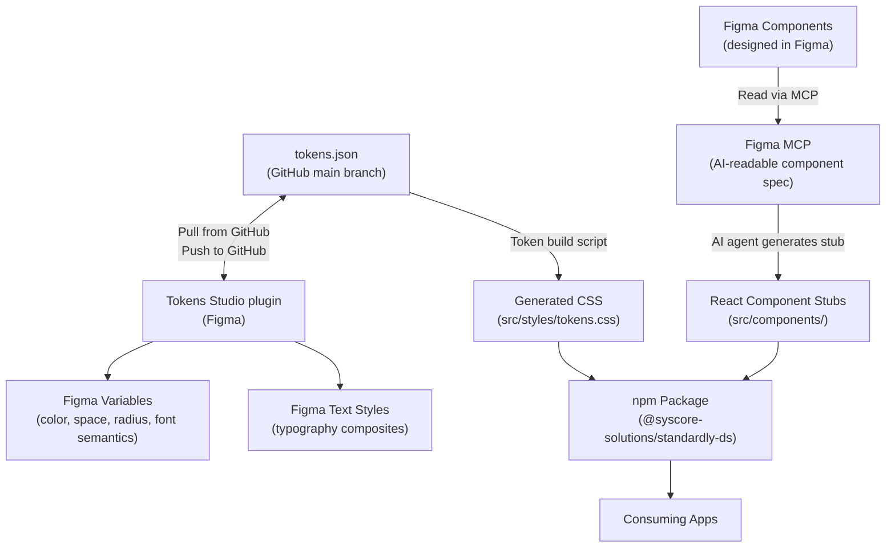

# Architecture — Standardly Design System

> **Scope of this document**: Technical architecture only. Every design decision (token values, color philosophy, typography rationale, visual language) lives in `design.md`. Every product-level brief lives in `brief.md`. This document tells contributors and AI agents *how the system is built, how data flows through it, and how to extend it without breaking conventions.*

> **⚠️ Current vs Planned.** This repo is at **Phase 1 (tokens only)**. Roughly the first third of this document describes what exists today (`tokens.json`, the Figma/Tokens Studio sync, doc conventions). **Sections 5–8 (components, CSS build pipeline, Storybook/Chromatic, npm package) describe the _planned_ Phase 2–4 architecture — none of it is built yet.** There is no `package.json` and no build step in the repo; `src/` and `.storybook/` exist only as placeholder scaffolds (READMEs, no code — see §2.1). Treat those sections as the design intent to build toward, not a description of current reality. See [§11 Phased Roadmap](#11-phased-roadmap) for what is real vs. planned.

---

## Table of Contents

1. [Overview](#1-overview)
2. [Repository Structure](#2-repository-structure)
3. [Token Architecture](#3-token-architecture)
4. [Figma Sync Architecture](#4-figma-sync-architecture)
5. [Component Architecture](#5-component-architecture)
6. [Token-to-CSS Build Pipeline](#6-token-to-css-build-pipeline)
7. [Storybook and Chromatic Pipeline](#7-storybook-and-chromatic-pipeline)
8. [npm Package Architecture](#8-npm-package-architecture)
9. [Contributing Conventions](#9-contributing-conventions)
10. [Explicit Non-Goals (v1)](#10-explicit-non-goals-v1)
11. [Phased Roadmap](#11-phased-roadmap)
12. [Decision Log](#12-decision-log)

---

## 1. Overview

`standardly-ds` is the design system repository for the Standardly platform — an agentic compliance-intelligence product. This repo is the single source of truth for all design tokens, component definitions, and the design-to-code synchronization pipeline.

### The Three Layers

The entire system is organized around three layers, each owning a distinct artifact and a distinct responsibility:

```
┌─────────────────────────────────────────────────────────┐
│  LAYER 1 — FIGMA                                        │
│  Figma Variables, Text Styles, Component definitions    │
│  (visual source of truth for design)                    │
└─────────────────────┬───────────────────────────────────┘
                      │  Tokens Studio plugin (bidirectional)
                      │  Figma MCP (component read → code)
┌─────────────────────▼───────────────────────────────────┐
│  LAYER 2 — THIS REPO (standardly-ds)                    │
│  tokens.json    → W3C DTCG design tokens                │
│  src/components → React + TypeScript components         │
│  src/styles/    → Generated CSS custom properties       │
└─────────────────────┬───────────────────────────────────┘
                      │  npm private package
┌─────────────────────▼───────────────────────────────────┐
│  LAYER 3 — CONSUMING APPS                               │
│  Standardly web app, marketing site, AI tools           │
│  (import the npm package, use tokens + components)      │
└─────────────────────────────────────────────────────────┘
```

### How This Repo Relates to Other Docs

| File | Purpose |
|---|---|
| `README.md` | Quick-start guide: token structure summary, Figma sync workflow (lives at repo root) |
| `brief.md` | Product and design brief: personas, emotional goals, brand direction |
| `design.md` | All design decisions: token value rationale, color choices, typography — **currently empty; not yet written** |
| `architecture.md` | ← **This file.** Technical architecture, data flows, conventions |
| `memory.md` | AI-only working memory: current state, locked decisions, known doc drift, open questions |

**Rule**: When in doubt about where something belongs — if it is a "why we chose X value" decision, it goes in `design.md`. If it is a "how the system is structured / how to do X" decision, it goes here.

---

## 2. Repository Structure

### 2.1 Current Layout (Phase 1 — tokens only)

> **Flat by design.** All docs live at the repo **root** — no `ai/` or `docs/` subfolders. This is deliberate: it removes any path ambiguity for AI agents and humans alike. **Naming rule:** convention files that expect an uppercase name stay uppercase (`README.md`, `AGENTS.md`, `CLAUDE.md`); every other file is fully lowercase.
>
> The Phase 2+ code directories (`src/`, `.storybook/`) were **pre-scaffolded 2026-07-10** as placeholder READMEs only — no code, no `package.json`, no build. Each placeholder says what lands there and which section governs it.

```
standardly-ds/
├── tokens.json      # All design tokens — W3C DTCG format. THE canonical source. Tokens Studio syncs this path.
├── README.md        # Token structure summary + Figma sync quick-start. Repo entry point.
├── AGENTS.md        # Agent guide (auto-discovered). Thin — points to memory.md.
├── CLAUDE.md        # Claude Code pointer → AGENTS.md.
├── memory.md        # Durable AI working memory: current state, locked decisions, known drift, open questions.
├── brief.md         # Product and design brief.
├── design.md        # Design decisions (token values, rationale) — scaffold only, not yet written.
├── architecture.md  # This file.
├── roadmap.md       # Long-term plan: phase backlogs (P1–P4) + just-in-time weekly sprints.
├── tasks.md         # Working surface: the entire active sprint, tiered detail.
├── changelog.md     # Daily work log — one datestamped entry per day, newest first.
├── src/             # PLACEHOLDER SCAFFOLD — READMEs only, no code until Phase 2
│   ├── tokens/      #   → future transform.ts + utils.ts (§6)
│   ├── components/  #   → future React + TS + Radix components (§5)
│   └── styles/      #   → future generated tokens.css (§6.2) — never hand-edited
├── .storybook/      # PLACEHOLDER SCAFFOLD — future main.ts / preview.ts (§7)
├── explorations/    # SPRINT S1 workspace (time-boxed) — 3 design-direction demos (o1/o2/o3),
│                    #   one Vite+React app. NOT the Phase-2 library; see explorations/README.md + roadmap.md.
├── .claude/         # Local Claude Code settings (permissions allowlist).
└── .gitignore       # Ignores macOS cruft, node_modules/dist, regenerable graphify-out/
```

### 2.2 Planned Layout (Phase 2+)

> The `src/` and `.storybook/` directories below already exist as **placeholder scaffolds** (READMEs only, added 2026-07-10). Everything else code-related (`package.json`, `tsconfig*`, actual `.ts`/`.tsx`/`.css` files) arrives when Phase 2 starts. All docs stay flat at root, unchanged.

```
standardly-ds/
├── tokens.json                    # Unchanged — still the canonical token source, stays at root
├── src/
│   ├── tokens/                    # Token transform scripts
│   │   ├── transform.ts           # Reads tokens.json → generates CSS variables
│   │   └── utils.ts               # Reference resolver, type helpers
│   ├── components/                # React + TypeScript components
│   │   ├── Button/
│   │   │   ├── Button.tsx
│   │   │   ├── Button.types.ts
│   │   │   ├── Button.stories.tsx
│   │   │   └── index.ts
│   │   └── index.ts               # Barrel export for all components
│   └── styles/
│       └── tokens.css             # Generated CSS custom properties (DO NOT EDIT MANUALLY)
├── .storybook/
│   ├── main.ts
│   └── preview.ts
├── package.json
├── tsconfig.json
├── tsconfig.build.json
├── README.md                      # Docs unchanged — all stay flat at root
├── AGENTS.md
├── CLAUDE.md
├── memory.md
├── brief.md
├── design.md
├── architecture.md
├── roadmap.md
├── tasks.md
├── changelog.md
├── .claude/                       # Local Claude Code settings
└── .gitignore
```

> **Critical rule**: `src/styles/tokens.css` is a **generated file**. Never edit it by hand. Always regenerate it by running the token build script after modifying `tokens.json`.

---

## 3. Token Architecture

### 3.1 Format Authority

**`tokens.json` is the canonical source of truth for all design tokens.**

The file follows the **W3C Design Tokens Community Group (DTCG) format** — specifically the W3C DTCG draft specification. This means:

- Every token is an object with a `$type` and a `$value` key
- References use `{dot.path.notation}` inside string values
- Token sets are top-level keys in the JSON object (`primitive`, `semantic`)
- Set order is declared in `$metadata.tokenSetOrder`

**Tokens Studio extensions** (`com.figma.scopes`, `com.figma.hiddenFromPublishing`) are stored in the `$extensions` key on individual tokens. These are Figma-layer metadata and have no effect on the W3C spec. The build pipeline must strip them when generating CSS output. They must not be considered when reading or interpreting token values.

```json
// W3C DTCG-compliant token with Figma-layer metadata
{
  "primitive": {
    "color": {
      "slate": {
        "50": {
          "$extensions": {
            "com.figma.scopes": ["ALL_SCOPES"],    // Figma metadata — strip at build time
            "com.figma.hiddenFromPublishing": false // Figma metadata — strip at build time
          },
          "$type": "color",         // W3C DTCG $type
          "$value": "#f5f7fa"       // W3C DTCG $value
        }
      }
    }
  }
}
```

**Why W3C DTCG over the native Tokens Studio format?** See [Decision Log §12.1](#121-why-w3c-dtcg-over-tokens-studio-native-format).

### 3.2 Token Set Hierarchy

The file contains exactly **two token sets**, ordered in `$metadata.tokenSetOrder`:

```json
"$metadata": {
  "tokenSetOrder": ["primitive", "semantic"]
}
```

#### `primitive`
- Raw values only. No references to other tokens.
- These are the *atoms* of the system — the complete universe of available values.
- A consumer of the `primitive` set alone can reconstruct any value the system uses.
- **Rule**: Primitive tokens MUST NOT contain `{reference}` syntax. If you're writing a reference in a primitive token, it belongs in `semantic`.

#### `semantic`
- Role-based aliases that reference **primitives only**.
- These are what consuming code actually uses — never reference a primitive token directly in code.
- **Rule**: Semantic tokens MUST reference only `primitive` tokens, never other semantic tokens.
- **Rule**: References omit the set name prefix. Write `{color.slate.900}`, not `{primitive.color.slate.900}`.
- **Rule**: No circular references. Primitives → (referenced by) → Semantics. That is the only allowed direction.

```json
// Correct: semantic references a primitive
"semantic": {
  "color": {
    "text": {
      "primary": {
        "$type": "color",
        "$value": "{color.slate.900}"   // references primitive.color.slate.900
      }
    }
  }
}

// WRONG: semantic referencing a semantic
"text": {
  "body": {
    "$value": "{color.text.primary}"    // forbidden — do not do this
  }
}
```

#### `$themes`
The `$themes` array is intentionally `[]`. There is a single light theme. Dark mode is explicitly out of scope for v1. See [§10](#10-explicit-non-goals-v1).

### 3.3 Naming Conventions

These conventions are **binding**. All current tokens follow them. All future tokens must follow them. They exist to ensure consistency across Figma Variables, CSS custom properties, and TypeScript types.

#### Scale Abbreviations

Always use the T-shirt size abbreviation system. **Never deviate, never abbreviate differently.**

| Scale level | Token name |
|---|---|
| Extra-extra-small | `2xs` |
| Extra-small | `xs` |
| Small | `sm` |
| Medium | `md` |
| Large | `lg` |
| Extra-large | `xl` |
| 2× extra-large | `2xl` |
| 3× extra-large | `3xl` |
| (and so on) | `4xl`, `5xl`, `6xl` |

**Forbidden patterns**: `s`, `m`, `l`, `small`, `medium`, `large`, `S`, `M`, `L`. These break consistency with the rest of the scale.

#### Color Ramp Steps

Color scales use numeric steps: `50`, `100`, `200`, `300`, `400`, `500`, `600`, `700`, `800`, `900`, `950`. A complete ramp has all 11 steps. The `neutral` ramp is special — it only contains `white` and `black` (not numeric steps).

#### Semantic Grouping Pattern

Semantic color tokens follow the `category.subcategory.role` pattern:

```
color.bg.default
color.bg.subtle
color.text.primary
color.text.secondary
color.border.default
color.action.primary
color.feedback.success.bg
color.feedback.success.text
color.feedback.success.border
```

#### Typography Composite Tokens

Typography composites use `$type: "typography"` and `$value` as an object with **singular** property keys:

```json
"H1": {
  "$type": "typography",
  "$value": {
    "fontFamily": "{fontFamily.heading}",
    "fontSize": "{fontSize.5xl}",
    "fontWeight": "{fontWeight.bold}",
    "lineHeight": "{lineHeight.normal}",
    "letterSpacing": "{letterSpacing.none}",
    "paragraphSpacing": "0",
    "paragraphIndent": "0",
    "textCase": "none",
    "textDecoration": "none"
  }
}
```

**Key rule**: Use `fontFamily` (not `font-family`), `fontSize` (not `font-size`), etc. — camelCase, singular, matching W3C DTCG composite type property names.

### 3.4 Complete Token Catalog

This section documents every token category in the current `tokens.json`. This is the authoritative reference — if `tokens.json` and this section disagree, `tokens.json` wins and this section must be updated.

#### `primitive.color`

| Ramp | Steps | Role in semantic layer |
|---|---|---|
| `neutral` | `white`, `black` | Surface and text extremes |
| `slate` | `50`–`950` | Neutral UI — 90% of the interface |
| `purple` | `50`–`950` | Primary / brand color |
| `mint` | `50`–`950` | Success states |
| `red` | `50`–`950` | Error / destructive states |
| `yellow` | `50`–`950` | Warning states |
| `teal` | `50`–`950` | Available for future use |
| `blue` | `50`–`950` | Info, links |
| `pink` | `50`–`950` | Available for future use |

#### `primitive.size`

Sizing scale, `2xs`–`3xl` (values: `8`, `12`, `16`, `20`, `24`, `32`, `48`, `64`). `$type: "sizing"`.

#### `primitive.space`

Spacing scale, `3xs`–`6xl` (values: `2`, `4`, `8`, `12`, `16`, `20`, `24`, `32`, `40`, `48`, `64`, `80`). `$type: "spacing"`.

#### `primitive.radius`

Border-radius scale: `none` (0), `sm` (4), `md` (8), `lg` (12), `xl` (16), `2xl` (24), `full` (9999). `$type: "borderRadius"`.

#### `primitive.border`

Border-width scale: `none` (0), `sm` (0.5), `md` (1), `lg` (2), `xl` (4). `$type: "borderWidth"`.

#### `primitive.opacity`

Opacity scale: `0` (0%), `10` (10%), `20` (20%), `40` (40%), `60` (60%), `80` (80%), `100` (100%). `$type: "opacity"`.

#### `primitive.fontFamily`

| Token | Value |
|---|---|
| `fontFamily.heading` | `Cal Sans` |
| `fontFamily.body` | `Geist` |

`$type: "fontFamilies"`.

#### `primitive.fontWeight`

| Token | Value |
|---|---|
| `fontWeight.regular` | `400` |
| `fontWeight.medium` | `500` |
| `fontWeight.semibold` | `600` |
| `fontWeight.bold` | `700` |

`$type: "fontWeights"`.

#### `primitive.fontSize`

Scale: `xs` (12), `sm` (14), `md` (16), `lg` (18), `xl` (20), `2xl` (24), `3xl` (32), `4xl` (40), `5xl` (48), `6xl` (56). `$type: "fontSizes"`.

#### `primitive.lineHeight`

| Token | Value |
|---|---|
| `lineHeight.tight` | `100%` |
| `lineHeight.normal` | `125%` |
| `lineHeight.relaxed` | `150%` |

`$type: "lineHeights"`.

#### `primitive.letterSpacing`

| Token | Value |
|---|---|
| `letterSpacing.none` | `0%` |
| `letterSpacing.wide` | `5%` |
| `letterSpacing.wider` | `10%` |

`$type: "letterSpacing"`.

---

#### `semantic.color.bg` — Surface backgrounds

| Token | References | Purpose |
|---|---|---|
| `color.bg.default` | `{color.neutral.white}` | Default page/card surface |
| `color.bg.subtle` | `{color.slate.50}` | Subtle surface tint |
| `color.bg.muted` | `{color.slate.100}` | Muted/secondary surface |
| `color.bg.emphasis` | `{color.slate.200}` | Emphasized/active surface |
| `color.bg.inverse` | `{color.slate.900}` | Dark inverse surface |
| `color.bg.disabled` | `{color.slate.100}` | Disabled element background |
| `color.bg.brand` | `{color.purple.50}` | Light brand-tinted surface |
| `color.bg.brandEmphasis` | `{color.purple.100}` | Emphasized brand surface |

#### `semantic.color.text` — Text roles

| Token | References | Purpose |
|---|---|---|
| `color.text.primary` | `{color.slate.900}` | Primary body text |
| `color.text.secondary` | `{color.slate.600}` | Supporting / secondary text |
| `color.text.tertiary` | `{color.slate.400}` | Placeholder, hint, meta text |
| `color.text.disabled` | `{color.slate.300}` | Disabled text |
| `color.text.inverse` | `{color.neutral.white}` | Text on dark backgrounds |
| `color.text.link` | `{color.blue.600}` | Hyperlink text |
| `color.text.linkHover` | `{color.blue.700}` | Hyperlink hover state |
| `color.text.brand` | `{color.purple.700}` | Brand-colored text |
| `color.text.onBrand` | `{color.neutral.white}` | Text on brand-colored backgrounds |

#### `semantic.color.border` — Border roles

| Token | References | Purpose |
|---|---|---|
| `color.border.default` | `{color.slate.200}` | Standard border |
| `color.border.subtle` | `{color.slate.100}` | Subtle / light border |
| `color.border.strong` | `{color.slate.300}` | Emphasized border |
| `color.border.focus` | `{color.purple.500}` | Focus ring / active state border |
| `color.border.disabled` | `{color.slate.200}` | Disabled element border |
| `color.border.inverse` | `{color.slate.700}` | Border on dark surfaces |

#### `semantic.color.action` — Interactive fills

| Token | References | Purpose |
|---|---|---|
| `color.action.primary` | `{color.purple.600}` | Primary button fill |
| `color.action.primaryHover` | `{color.purple.700}` | Primary button hover |
| `color.action.primaryActive` | `{color.purple.800}` | Primary button active/press |
| `color.action.primaryDisabled` | `{color.slate.200}` | Primary button disabled |
| `color.action.secondary` | `{color.neutral.white}` | Secondary button fill |
| `color.action.secondaryHover` | `{color.slate.50}` | Secondary button hover |
| `color.action.secondaryBorder` | `{color.slate.200}` | Secondary button border |
| `color.action.destructive` | `{color.red.600}` | Destructive action fill |
| `color.action.destructiveHover` | `{color.red.700}` | Destructive hover |

#### `semantic.color.feedback` — Status / system feedback

Each feedback category has three sub-tokens: `bg`, `text`, `border`.

| Category | `bg` references | `text` references | `border` references |
|---|---|---|---|
| `feedback.success` | `{color.mint.50}` | `{color.mint.700}` | `{color.mint.200}` |
| `feedback.warning` | `{color.yellow.50}` | `{color.yellow.800}` | `{color.yellow.200}` |
| `feedback.error` | `{color.red.50}` | `{color.red.700}` | `{color.red.200}` |
| `feedback.info` | `{color.blue.50}` | `{color.blue.700}` | `{color.blue.200}` |

#### `semantic.typography` — Composite text styles

| Token | Family | Size | Weight | Line height |
|---|---|---|---|---|
| `H1` | heading (Cal Sans) | `5xl` (48px) | bold | normal |
| `H2` | heading (Cal Sans) | `4xl` (40px) | bold | normal |
| `H3` | heading (Cal Sans) | `3xl` (32px) | semibold | normal |
| `H4` | heading (Cal Sans) | `2xl` (24px) | semibold | normal |
| `H5` | heading (Cal Sans) | `xl` (20px) | semibold | normal |
| `H6` | heading (Cal Sans) | `lg` (18px) | semibold | normal |
| `body.lg` | body (Geist) | `lg` (18px) | regular | relaxed |
| `body.md` | body (Geist) | `md` (16px) | regular | relaxed |
| `body.sm` | body (Geist) | `sm` (14px) | regular | normal |
| `label.md` | body (Geist) | `sm` (14px) | medium | normal |
| `label.sm` | body (Geist) | `xs` (12px) | medium | normal, wide letter-spacing |
| `caption` | body (Geist) | `xs` (12px) | regular | normal |

#### `semantic.radius` — Role-based border radii

| Token | References | Used for |
|---|---|---|
| `radius.control` | `{radius.md}` (8px) | Buttons, inputs, interactive controls |
| `radius.container` | `{radius.lg}` (12px) | Cards, panels, containers |
| `radius.overlay` | `{radius.xl}` (16px) | Modals, drawers, popovers |
| `radius.badge` | `{radius.full}` (9999px) | Pills, badges, tags |

### 3.5 Accessibility Enforcement

The system targets **WCAG 2.1 AA as a hard minimum, AAA where feasible**.

Token-level accessibility rules:

1. **All text/background pairs must meet contrast requirements.** For AA: ≥ 4.5:1 for normal text, ≥ 3:1 for large text. For AAA: ≥ 7:1 for normal text.
2. **Status must never rely on color alone.** Any token used for compliance status or feedback must have a paired non-color signal documented (icon shape, label). This applies to all `semantic.color.feedback.*` tokens.
3. **Focus ring tokens are mandatory.** `color.border.focus` (`{color.purple.500}`) is the designated focus ring color. All interactive components must implement visible focus rings using this token. It must never be `outline: none` without a visual replacement.
4. **Validate before committing.** Until automated tooling exists, run contrast checks manually (using tools like the WebAIM Contrast Checker) before adding any new color pair.

---

## 4. Figma Sync Architecture

### 4.1 The Full Pipeline



### 4.2 Bidirectional Sync Rules

The Figma ↔ GitHub sync is bidirectional. The following rules define which side initiates each type of change to prevent conflicts and data loss.

| Change type | Where to make the change | Then sync to |
|---|---|---|
| New token added (new value, scale step, or semantic role) | `tokens.json` (code) | Pull into Figma via Tokens Studio: **Pull from GitHub** |
| Token value tweaked in Figma (e.g., designer adjusts a color shade) | Figma Variables | Push to GitHub via Tokens Studio: **Push to GitHub** → commit & push to main |
| Token renamed | `tokens.json` (code) | Pull into Figma; also update all consuming apps (MAJOR semver bump) |
| Token deleted | `tokens.json` (code) | Pull into Figma; also update all consuming apps (MAJOR semver bump) |
| New component (design-first) | Figma (design the component first) | Read via Figma MCP → generate React stub → implement → commit |
| Component code bug fix or API change | `src/components/` (code) | Notify the designer; update Figma component spec manually |
| Typography text style changed | `tokens.json` (code, `semantic.typography.*`) | Pull into Figma → Figma will update Text Styles |

**Conflict prevention rule**: Never edit `tokens.json` and Figma Variables simultaneously for the same token without syncing first. If you've made local changes to `tokens.json` that haven't been pushed to GitHub yet, do not use **Push to GitHub** in Tokens Studio — this will overwrite your local changes. Always push `tokens.json` changes to GitHub before triggering a sync from either side.

### 4.3 Tokens Studio Configuration

The Tokens Studio plugin is configured with GitHub sync against the **`main` branch**.

**Export targets within Figma:**
- **Figma Variables**: `semantic.color.*`, `semantic.radius.*`, `primitive.space.*`, `primitive.fontFamily`, `primitive.fontWeight`, `primitive.fontSize`, `primitive.lineHeight`, `primitive.letterSpacing` *(note: `semantic.space` is not yet defined — spacing is exported from the primitive `space` scale until semantic space roles exist)*
- **Figma Text Styles**: `semantic.typography.*` — exported with **"Create styles with variable references"** enabled, so text styles reference Figma Variables rather than hardcoded values.

**`$themes`** is `[]` — the plugin has no theme sets configured. Single light theme only.

### 4.4 Figma MCP Component Sync Workflow

Figma MCP (Model Context Protocol) is a first-class workflow in this system. It enables an AI agent to read Figma component specifications and generate accurate React component stubs, dramatically reducing the gap between design and code.

**Workflow steps:**

1. **Design the component in Figma** — define all variants, properties, auto-layout, and token connections.
2. **Open AI agent with Figma MCP access** (e.g., Claude with Figma MCP configured).
3. **Point the agent at the component** — provide the Figma file URL and component name.
4. **Agent reads the component spec** — MCP exposes: variant properties, layer structure, auto-layout rules, token references, and interactive states.
5. **Agent generates a React stub** — a TypeScript component file with prop types matching Figma variants, placeholder implementation, and a `.stories.tsx` file.
6. **Developer reviews and completes the stub** — fills in implementation logic, ensures Radix UI accessibility, and connects CSS variables.
7. **Commit to `src/components/`** — following the file structure convention in [§5.3](#53-component-file-structure).

**What MCP does NOT do automatically:**
- It does not write the final production implementation (logic, state, event handlers).
- It does not verify accessibility — the developer must verify Radix bindings.
- It does not run tests — the developer must add and run tests.
- It is not a CI step — this is a manual-assist workflow.

---

## 5. Component Architecture

### 5.1 Technology Stack

| Concern | Technology | Why |
|---|---|---|
| Component language | React + TypeScript | Specified in brief.md; type safety for design system APIs |
| Accessibility layer | Radix UI Primitives | Handles all ARIA roles, keyboard navigation, focus management |
| Styling | CSS custom properties | Consumers import one CSS file; works with any styling system |
| Component dev environment | Storybook | Visual development, documentation, and Chromatic integration |
| Visual regression | Chromatic | Automated snapshot diffing against Storybook stories |

**Explicitly excluded:**
- **No Tailwind CSS** in the component library itself. Consuming apps may use Tailwind, but the design system must not force a dependency on it.
- **No shadcn/ui**. Components are built bespoke. The composition and accessibility *patterns* from shadcn/ui are inspiration; the package is not a dependency.
- **No CSS-in-JS** (styled-components, emotion, etc.). Token values are delivered as CSS custom properties via an imported CSS file.

### 5.2 Component Design Principles

1. **Composable** — build small, focused primitives that compose into patterns. A `Button` should not contain a `Modal`. Composition happens at the consuming-app level.
2. **Accessible by default** — Radix UI handles ARIA roles, keyboard events, and focus trapping. Components must not override or break Radix behavior.
3. **Token-driven** — every visual property (color, spacing, radius, typography) must come from a CSS custom property defined in `tokens.css`. Hardcoded values in component styles are a bug.
4. **Variant-aware** — component props map 1:1 to Figma component variants. A `Button` with `variant="primary"` in code must match the `variant=Primary` component in Figma.
5. **Zero-opinion on layout** — components do not impose margin or positioning on their consumers. External spacing is the consuming context's responsibility.

### 5.3 Component File Structure

Each component lives in its own directory inside `src/components/`:

```
src/components/Button/
├── Button.tsx          # Component implementation
├── Button.types.ts     # TypeScript interfaces for props and variants
├── Button.stories.tsx  # Storybook stories — all variants × states
├── Button.test.tsx     # Unit and accessibility tests (future — see Phase 2)
└── index.ts            # Re-exports: export { Button } from './Button'
```

```
src/components/
└── index.ts            # Barrel export: export * from './Button'
                        #                export * from './Input'
                        #                ... (all components)
```

**Rules for new components:**
- A new component directory must contain at minimum: `ComponentName.tsx`, `ComponentName.types.ts`, `ComponentName.stories.tsx`, and `index.ts`.
- The `.stories.tsx` file must cover **every variant** and **every interactive state** (default, hover, focus, disabled, loading if applicable).
- Stories are the visual contract between Figma and code. Chromatic compares against them.

### 5.4 Component Naming Conventions

- Component files and exports: **PascalCase** (`Button`, `InputField`, `StatusBadge`)
- Variant prop values: **camelCase strings** matching Figma variant property names lowercased (`"primary"`, `"secondary"`, `"destructive"`)
- Event handler props: `on` prefix + PascalCase verb (`onClick`, `onChange`, `onBlur`)
- Ref forwarding: all interactive components must forward refs using `React.forwardRef`
- `asChild` pattern: use Radix's `asChild` prop where the component can render as a different element (e.g., `Button` rendering as a router `Link`)

---

## 6. Token-to-CSS Build Pipeline

### 6.1 Overview

The build pipeline reads `tokens.json`, resolves all `{reference}` values, strips Figma metadata extensions, and outputs `src/styles/tokens.css` containing CSS custom properties on the `:root` selector.

This output file is:
- Shipped inside the npm package
- Imported once by the consuming app's entry point
- The only mechanism through which design tokens cross into consuming code

### 6.2 Generated CSS Shape

The generated CSS file follows this structure:

```css
/* src/styles/tokens.css — GENERATED FILE. DO NOT EDIT MANUALLY. */
/* Regenerate by running: npm run build:tokens */

:root {
  /* ─── Primitive: Color — Neutrals ─── */
  --color-neutral-white: #ffffff;
  --color-neutral-black: #000000;

  /* ─── Primitive: Color — Slate ─── */
  --color-slate-50: #f5f7fa;
  --color-slate-100: #f2f5f8;
  --color-slate-200: #eaecf0;
  --color-slate-300: #cacfd8;
  --color-slate-400: #99a0ae;
  --color-slate-500: #717784;
  --color-slate-600: #525866;
  --color-slate-700: #2b303b;
  --color-slate-800: #222530;
  --color-slate-900: #181b25;
  --color-slate-950: #0e121b;

  /* ... (all other primitive color ramps) ... */

  /* ─── Primitive: Space ─── */
  --space-3xs: 2px;
  --space-2xs: 4px;
  --space-xs: 8px;
  --space-sm: 12px;
  --space-md: 16px;
  --space-lg: 20px;
  --space-xl: 24px;
  --space-2xl: 32px;
  --space-3xl: 40px;
  --space-4xl: 48px;
  --space-5xl: 64px;
  --space-6xl: 80px;

  /* ─── Primitive: Radius ─── */
  --radius-none: 0px;
  --radius-sm: 4px;
  --radius-md: 8px;
  --radius-lg: 12px;
  --radius-xl: 16px;
  --radius-2xl: 24px;
  --radius-full: 9999px;

  /* ... (other primitive categories) ... */

  /* ─── Semantic: Background ─── */
  --color-bg-default: var(--color-neutral-white);
  --color-bg-subtle: var(--color-slate-50);
  --color-bg-muted: var(--color-slate-100);
  --color-bg-emphasis: var(--color-slate-200);
  --color-bg-inverse: var(--color-slate-900);
  --color-bg-disabled: var(--color-slate-100);
  --color-bg-brand: var(--color-purple-50);
  --color-bg-brand-emphasis: var(--color-purple-100);

  /* ─── Semantic: Text ─── */
  --color-text-primary: var(--color-slate-900);
  --color-text-secondary: var(--color-slate-600);
  --color-text-tertiary: var(--color-slate-400);
  /* ... */

  /* ─── Semantic: Typography (expanded composites) ─── */
  --typography-h1-font-family: var(--font-family-heading);
  --typography-h1-font-size: var(--font-size-5xl);
  --typography-h1-font-weight: var(--font-weight-bold);
  --typography-h1-line-height: var(--line-height-normal);
  /* ... */
}
```

**CSS variable naming rule**: Token path separators (`.`) become hyphens (`-`) in CSS variable names. camelCase token names are converted to kebab-case.

### 6.3 Token Build Tool

> **Status**: Tool selection is pending (Phase 2). Candidates are documented here for the decision to be made at implementation time.

| Tool | Pros | Cons |
|---|---|---|
| **Style Dictionary** (recommended) | Battle-tested, W3C DTCG support via plugins, configurable transforms, active community | Requires configuration, larger dependency |
| **Custom Node.js script** | Zero dependencies, full control | Must maintain ourselves, reinvents the wheel |
| **Token Transformer (Tokens Studio)** | Built for Tokens Studio format | Tightly coupled to Tokens Studio, less flexible |

**Decision required in Phase 2**: Choose and document the tool here, including the configuration file path and all transform rules applied.

The build script will be invokable via:
```bash
npm run build:tokens
```
And it will always output to `src/styles/tokens.css`.

---

## 7. Storybook and Chromatic Pipeline

### 7.1 Storybook

Storybook is the component development and documentation environment. It serves three purposes:
1. **Development** — visual sandbox for building components in isolation
2. **Documentation** — living reference for all components and their variants
3. **Test substrate** — the story matrix is what Chromatic snapshots against

**Required addons:**
- `@storybook/addon-a11y` — runs axe accessibility audits in the Storybook panel. All stories must pass before merge.
- `@storybook/addon-designs` — links each story to its corresponding Figma frame for side-by-side comparison.

**Story requirements per component:**
- One story per variant × state combination (e.g., `Button Primary Default`, `Button Primary Hover`, `Button Primary Disabled`)
- Use Storybook's `args` system (not hardcoded props) so controls work in the Storybook UI
- Every story must have a meaningful `name` and `title` for discoverability

### 7.2 Chromatic

Chromatic is the visual regression testing tool. It takes snapshots of every Storybook story and compares them against the previously approved baseline.

**Plan considerations**: The Chromatic free plan includes approximately 5,000 snapshots per month. For a design system with many components × variants × states, this limit can be reached. Monitor usage and upgrade the plan as the component library grows.

**Workflow:**
1. Changes that affect visual output trigger a new Chromatic build
2. Chromatic compares new snapshots against the approved baseline
3. Visual differences are flagged for review in the Chromatic web UI
4. A designer must review and approve visual diffs — this is not a developer-only decision
5. Once approved, the new snapshots become the baseline

**Baseline update policy**: Never approve Chromatic diffs without cross-referencing the change against the Figma design. A diff should exactly match the intended change in Figma. Unexplained diffs are bugs.

### 7.3 Manual Workflow (Pre-CI, Phase 2)

Until a CI/CD pipeline is added (Phase 4), all Storybook and Chromatic steps are performed manually. This is the required workflow for any change that touches component visual output:

**Step 1 — Make token changes (if applicable)**
```bash
# Edit tokens.json
# Then regenerate CSS:
npm run build:tokens
```

**Step 2 — Develop the component or update the story**
```bash
npm run storybook
# Verify the component visually in the browser
# Verify all variants and states look correct
```

**Step 3 — Run accessibility audit**
- Open the Storybook `a11y` panel for each story
- Resolve all axe violations before proceeding

**Step 4 — Commit and push to main**
```bash
git add .
git commit -m "feat(components): add Button component with primary/secondary variants"
git push origin main
```

**Step 5 — Trigger Chromatic build**
```bash
npx chromatic --project-token=<token>
# Or via the Chromatic web UI: trigger a build manually
```

**Step 6 — Review visual diffs**
- Open the Chromatic build URL
- Review every flagged diff
- Get designer sign-off on any diff that changes visual appearance
- Accept or deny snapshots in the Chromatic UI

**Step 7 — Update baselines**
- Accept approved diffs in Chromatic — these become the new baseline

---

## 8. npm Package Architecture

### 8.1 Package Identity

| Property | Value |
|---|---|
| Package name | `@syscore-solutions/standardly-ds` (exact name TBD) |
| Registry | npm private — GitHub Packages or npmjs.com private scope |
| Visibility | Private |
| Language | TypeScript (ships `.d.ts` declaration files) |
| Module formats | ESM + CJS |

### 8.2 Package Exports Map

The package exposes two entry points, which must be declared in `package.json`'s `exports` field:

```json
{
  "name": "@syscore-solutions/standardly-ds",
  "exports": {
    ".": {
      "import": "./dist/index.js",
      "require": "./dist/index.cjs",
      "types": "./dist/index.d.ts"
    },
    "./styles": "./dist/tokens.css"
  },
  "main": "./dist/index.cjs",
  "module": "./dist/index.js",
  "types": "./dist/index.d.ts",
  "files": [
    "dist"
  ]
}
```

**Consumers use it like this:**
```tsx
// In the app's entry point (e.g., main.tsx or _app.tsx):
import '@syscore-solutions/standardly-ds/styles';

// Then in any component:
import { Button, StatusBadge, InputField } from '@syscore-solutions/standardly-ds';
```

The CSS import is **required** and must happen exactly once at the app root. Without it, all components will render without their tokens.

### 8.3 Build Tool

> **Status**: Tool selection is pending (Phase 3). Candidates:

| Tool | Pros | Cons |
|---|---|---|
| **tsup** (recommended) | Minimal config, ESM+CJS out of the box, fast esbuild-based, TypeScript first | Newer, less battle-tested |
| **Vite library mode** | Familiar if using Vite for Storybook | More config needed for dual CJS/ESM |
| **Rollup** | Maximum control | Verbose configuration |

**Decision required in Phase 3**: Choose and document here.

The build command will be:
```bash
npm run build
```
Output goes to `dist/` which is the only directory included in the npm publish.

### 8.4 How Consumers Authenticate

Consuming apps must configure npm to authenticate against the private registry. Documentation for this will be provided in the `README.md` once the registry is finalized (Phase 3).

### 8.5 Semantic Versioning Rules

The package follows [Semantic Versioning (semver)](https://semver.org/) — `MAJOR.MINOR.PATCH`.

#### MAJOR version bump (breaking changes)
Any change that can break a consuming app without code changes on their side:

| Breaking change | Example |
|---|---|
| Token renamed | `color.text.primary` → `color.text.body` |
| Token deleted | Removing `color.border.subtle` |
| CSS variable renamed | `--color-text-primary` → `--text-primary` |
| Component prop renamed | `variant="primary"` → `variant="brand"` |
| Component prop removed | Removing the `size` prop from `Button` |
| Component removed | Deleting `LegacyCard` |
| Package entry point changed | Renaming the `./styles` export |

#### MINOR version bump (backward-compatible additions)
New capabilities that do not break existing usage:

| Non-breaking addition | Example |
|---|---|
| New token added | Adding `color.bg.overlay` |
| New component added | Adding `Tooltip` component |
| New component variant | Adding `variant="ghost"` to `Button` |
| New prop added with default | Adding `iconPosition="left"` with a sensible default |

#### PATCH version bump (backward-compatible fixes)

| Fix type | Example |
|---|---|
| Token value corrected | Fixing `mint-500` from wrong hex to correct hex |
| Component bug fixed | Fixing a focus ring not showing on keyboard navigation |
| Documentation update | Updating a story description |
| Accessibility fix | Correcting an ARIA label |

**Changelog**: Every version bump requires an entry in `CHANGELOG.md` (to be created in Phase 3) following the [Keep a Changelog](https://keepachangelog.com/) format.

---

## 9. Contributing Conventions

### 9.1 Token Conventions

Before adding or modifying any token:

1. **Decide the layer first.** Is this a raw value (primitive) or a role alias (semantic)? Never skip a layer — if you're adding a new role, you must reference an existing primitive.
2. **Follow the naming pattern exactly.** Use the scale abbreviation system (`2xs`, `xs`, `sm`, `md`, `lg`, `xl`, `2xl`, `3xl`). See [§3.3](#33-naming-conventions).
3. **Never hardcode a value in a semantic token.** Semantic `$value` fields must always be `{dot.path.references}`.
4. **Omit the set name in references.** Write `{color.slate.900}`, not `{primitive.color.slate.900}`.
5. **Validate contrast before committing.** If you add a new semantic color pair (text on background), check the contrast ratio. Minimum AA (4.5:1 normal text). Target AAA (7:1) where possible.
6. **Update README.md** if you add a new token category that isn't already listed there.
7. **Sync to Figma after pushing.** After pushing token changes to `main`, use Tokens Studio in Figma to **Pull from GitHub** so the design file stays in sync.

### 9.2 Component Conventions

Before implementing a new component:

1. **Check Figma first.** Every component must have a Figma counterpart. Use Figma MCP to read the component spec before writing code.
2. **Generate a stub via MCP.** Use the Figma MCP workflow ([§4.4](#44-figma-mcp-component-sync-workflow)) to create the initial file structure.
3. **Use Radix for any interactive behavior.** If the component involves focus management, keyboard navigation, ARIA roles, or overlay positioning, use the appropriate Radix UI primitive as the base.
4. **All styling via CSS variables.** Import from `tokens.css` variables only. No hardcoded hex values, no hardcoded pixel values not from the token scale.
5. **Write stories before merge.** A component without stories cannot be merged. Stories must cover all variants × all interactive states.
6. **Prop types in separate file.** Define all TypeScript interfaces and union types in `ComponentName.types.ts`, not inline in the component file.
7. **Forward refs.** All interactive components must use `React.forwardRef` so consumers can attach refs.

### 9.3 Commit Message Convention

This repo uses [Conventional Commits](https://www.conventionalcommits.org/).

**Format:**
```
type(scope): short description

[optional longer body]

[optional footer: BREAKING CHANGE: description]
```

**Allowed types:**

| Type | When to use |
|---|---|
| `feat` | New token, new component, new feature |
| `fix` | Bug fix in a component or incorrect token value |
| `chore` | Build scripts, tooling, dependencies, repo config |
| `docs` | Changes to markdown documentation only |
| `refactor` | Code restructure with no behavior change |
| `style` | Formatting, linting (no logic changes) |
| `test` | Adding or updating tests |

**Allowed scopes:**

| Scope | When to use |
|---|---|
| `tokens` | Changes to `tokens.json` |
| `components` | Changes in `src/components/` |
| `styles` | Changes to `src/styles/tokens.css` or the build pipeline |
| `storybook` | Changes to `.storybook/` config or story files |
| `build` | Build tooling, `package.json`, `tsconfig` |
| `docs` | `README.md`, `architecture.md`, `design.md`, `brief.md` |
| `release` | Version bump commits |

**Examples:**
```
feat(tokens): add color.bg.overlay semantic token

fix(tokens): correct mint-500 hex value from #1dc16b to #1fc16b

feat(components): add Button component with primary, secondary, and destructive variants

chore(storybook): update Chromatic baselines after button radius fix

docs(docs): update architecture.md token catalog with new bg tokens

feat(components): add Tooltip component

BREAKING CHANGE: Button prop 'kind' renamed to 'variant' to match Figma naming
```

### 9.4 Branch Naming

```
type/short-description-in-kebab-case
```

Examples:
```
feat/button-component
feat/add-overlay-tokens
fix/mint-500-hex-correction
chore/setup-storybook
docs/update-architecture-token-catalog
```

### 9.5 PR Workflow

1. **Branch off `main`.** All work happens on feature branches. Never commit directly to `main`.
2. **Keep PRs focused.** One logical change per PR. A PR that adds both a new component and refactors an unrelated utility is two PRs.
3. **Self-review before opening.** Run Storybook locally, verify all stories visually, run the a11y addon, check for console errors.
4. **PR description must include**: what changed, which Figma component/token it corresponds to (with a link), and a screenshot or Storybook link for visual changes.
5. **Chromatic review required** (once Storybook exists): No PR that changes visual output can be merged without Chromatic approval.
6. **Designer sign-off for visual changes**: Any change that affects visual appearance requires acknowledgment from the designer before merge.
7. **Merge strategy**: Squash and merge. Each PR becomes one commit on `main` with the conventional commit message from the PR title.

---

## 10. Explicit Non-Goals (v1)

The following are **explicitly out of scope** for the current version of this design system. They are listed here to prevent well-intentioned scope creep and to give AI agents clear boundaries.

| Feature | Status | Notes |
|---|---|---|
| **Dark mode** | ❌ Out of scope for v1 | Light is the only theme. `$themes` is `[]`. Do not add a dark theme token set. |
| **White-labeling / multi-brand** | ❌ Not architected yet | Planned future feature. Basic tier (logo + primary color override) is the target. Do not build a multi-brand system. |
| **Automated CI/CD pipeline** | ❌ Manual workflow only | GitHub Actions for automated publish and visual testing is a Phase 4 goal. |
| **React Native / mobile** | ❌ Not planned | This system is web-only. No react-native-specific tokens or components. |
| **Server-side rendering optimization** | ❌ Not planned for v1 | Components should be SSR-compatible but not optimized for SSR-specific patterns (e.g., no `use client` directives, no streaming-specific concerns). |
| **Automated token contrast validation** | ❌ Manual checklist only | Until CI exists, contrast checking is manual. Do not add tokens without manual verification. |
| **Animation / motion tokens** | ❌ Not yet in tokens.json | Motion is planned (brief.md §10) but tokens haven't been defined. Do not add them without a corresponding design.md entry. |
| **Elevation / shadow tokens** | ❌ Not yet in tokens.json | Elevation is planned but not yet defined. Same rule as motion. |

---

## 11. Phased Roadmap

| Phase | Status | Focus | Key deliverables |
|---|---|---|---|
| **Phase 1** | ✅ Current | Tokens | `tokens.json` in W3C DTCG format; Figma Variables sync via Tokens Studio; `README.md`, `brief.md`, `design.md`, `architecture.md` |
| **Phase 2** | 🔜 Planned | Components + Storybook | `src/components/` with Figma MCP-derived component stubs; Storybook setup; Chromatic integration; accessibility addon |
| **Phase 3** | 🔜 Planned | npm Package | Token-to-CSS build pipeline; component build (tsup or Vite); private npm package publish; semver + changelog; install docs |
| **Phase 4** | 🔜 Planned | Automation + Polish | GitHub Actions CI (Chromatic on PR, publish on tag); white-label token layer; motion and elevation tokens; animation tokens |

**Within Phase 1, remaining work includes:**
- Populating `design.md` with all design rationale
- Adding motion tokens to `tokens.json` once defined in `design.md`
- Adding elevation/shadow tokens to `tokens.json` once defined in `design.md`

---

## 12. Decision Log

A running record of key architectural decisions, when they were made, what alternatives were considered, and why the chosen option won. **All future architectural decisions must be logged here.**

### 12.1 Why W3C DTCG over Tokens Studio native format

**Date**: July 2026  
**Decision**: Use W3C DTCG format (`$type`, `$value`) as the canonical token format.  
**Alternatives considered**:
- Tokens Studio native format (no `$` prefix, proprietary reference syntax)

**Rationale**: W3C DTCG is an evolving open standard supported by an increasing number of tools (Style Dictionary v3+, Figma's own Variables API, Token Transformer). Committing to the open standard ensures the token file is portable — it can be consumed by any DTCG-aware tool, not just Tokens Studio. Tokens Studio supports W3C DTCG natively, so this choice has no downside for the Figma workflow.

---

### 12.2 Why bidirectional sync instead of code-first or design-first

**Date**: July 2026  
**Decision**: Bidirectional sync with explicit rules per change type.  
**Alternatives considered**:
- Code-first: `tokens.json` is always the master; Figma always pulls. Simpler, but designers can't make quick value adjustments in Figma without a code PR.
- Design-first: Figma is always the master; code always pulls. Simpler for designers, but risks designers changing tokens without code awareness.

**Rationale**: In practice, some changes originate in Figma (designer tweaks a color slightly) and some originate in code (developer adds a missing semantic token). Forcing all changes through one side creates unnecessary friction. The explicit rules in [§4.2](#42-bidirectional-sync-rules) prevent conflicts while allowing both sides to initiate appropriate changes.

---

### 12.3 Why CSS custom properties over Tailwind preset for token delivery

**Date**: July 2026  
**Decision**: Deliver tokens as a CSS file with CSS custom properties.  
**Alternatives considered**:
- Tailwind plugin/preset: tokens injected into a Tailwind config that consumers extend
- Style Dictionary JS exports: TypeScript constants that components import directly

**Rationale**: CSS custom properties are the most universal delivery mechanism. They work with any styling system — Tailwind, CSS modules, vanilla CSS, styled-components, or bare HTML. A Tailwind preset would force all consumers to use Tailwind. JS constants would require consumers to handle token-to-style mapping themselves and would not enable runtime overrides (needed for future white-labeling). CSS variables also support the future white-label override layer natively (via CSS cascade).

---

### 12.4 Why Radix UI over Headless UI for accessibility primitives

**Date**: July 2026  
**Decision**: Use Radix UI Primitives as the accessibility layer for interactive components.  
**Alternatives considered**:
- Headless UI (Tailwind Labs): simpler API, fewer components
- Pure ARIA: full bespoke implementation, no external dependency

**Rationale**: Radix UI has a broader component surface (dialogs, popovers, dropdown menus, tooltips, select, tabs, etc.) that covers the full component library scope defined in brief.md §17. Headless UI's component set is more limited. Pure ARIA implementation is expensive to maintain correctly across browsers and assistive technologies. Radix has excellent TypeScript support and a philosophy aligned with the design system's goals (composable, unstyled, accessible primitives).

---

### 12.5 Why monorepo-lite over a full monorepo (Nx / Turborepo)

**Date**: July 2026  
**Decision**: Single package repo with `src/tokens/`, `src/components/`, `src/styles/` — not a Nx/Turborepo monorepo.  
**Alternatives considered**:
- Nx/Turborepo monorepo with separate `@standardly/tokens` and `@standardly/components` packages

**Rationale**: The system is currently owned and maintained by one person. A full monorepo introduces significant tooling overhead (separate `package.json` per package, cross-package build coordination, workspace dependency management) that is not justified at this scale. The monorepo-lite structure keeps tooling simple and can be migrated to a proper monorepo if the system grows to require independent versioning of tokens vs. components. For now, a single npm package with both CSS tokens and React components is simpler for consumers (one install, one import).

---

### 12.6 Why semver over CalVer for package versioning

**Date**: July 2026  
**Decision**: Semantic Versioning (semver).  
**Alternatives considered**:
- Calendar Versioning (CalVer): `2026.07.1`

**Rationale**: Semver communicates the *nature* of a change, not just when it happened. For a design system, where consumers need to know immediately whether an update contains breaking changes (token renames, component API changes), semver's MAJOR.MINOR.PATCH signal is essential. CalVer is fine for products but provides no signal about compatibility.
